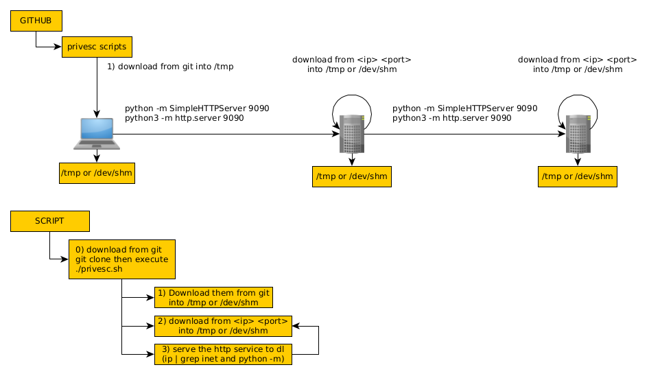

# PrivescToolkit




# Usage

```bash
wget url https://raw.githubusercontent.com/ech1/PrivescTK/master/privesc.sh -O - | bash
curl url https://raw.githubusercontent.com/ech1/PrivescTK/master/privesc.sh | bash
```

